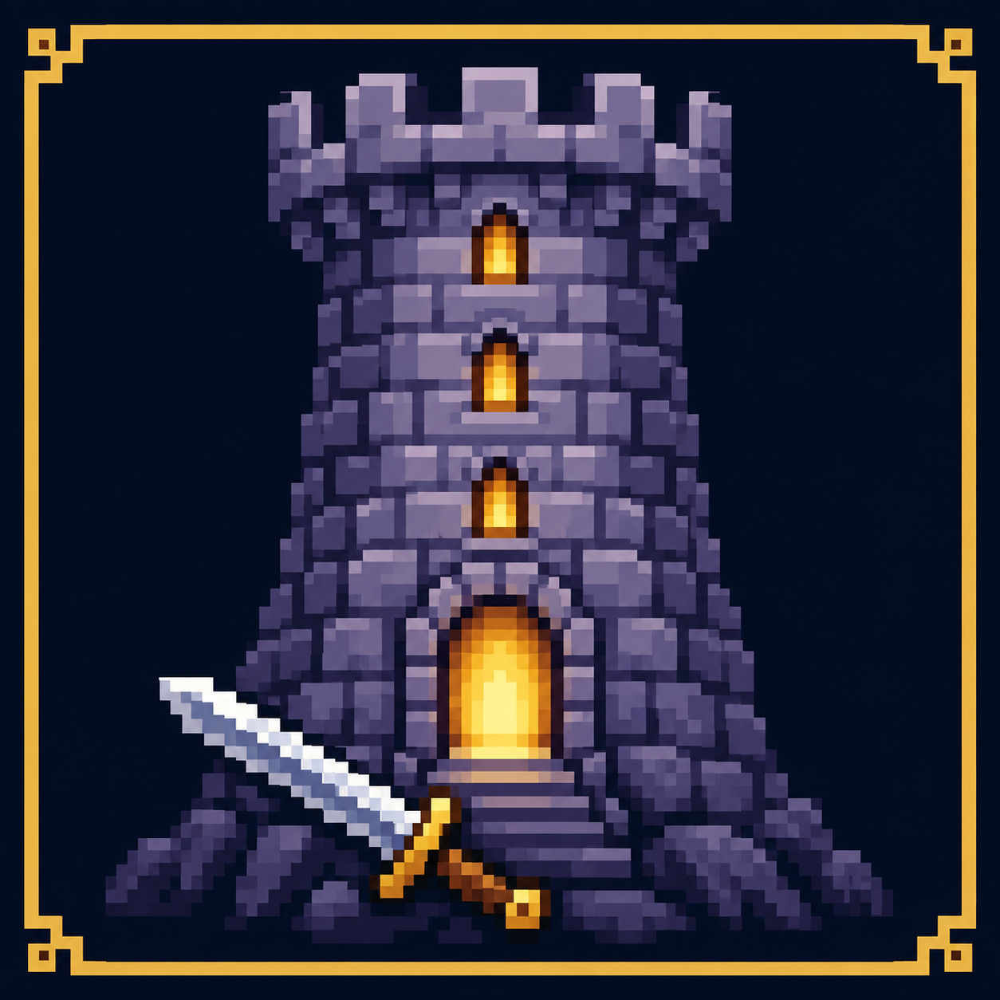
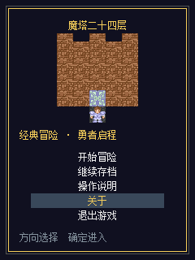
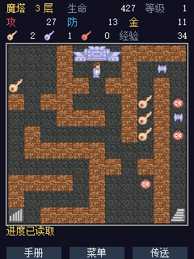
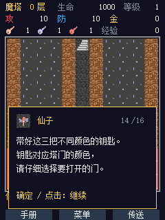
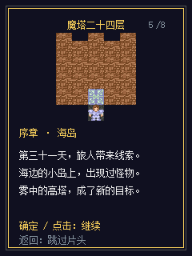
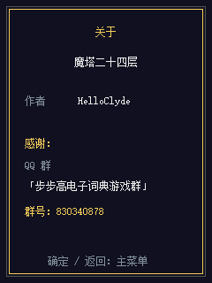
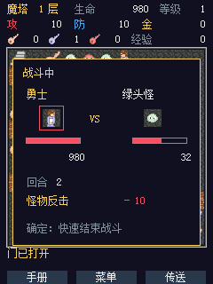

# 魔塔24层 · BBK 9588 原生版



面向 **步步高 BBK 9588、240×320 竖屏** 的原生 BDA 游戏。作者：**HelloClyde**。

经典 11×11 地图、像素角色、固定伤害战斗、商店、三色钥匙、怪物手册与楼层传送。包含序章、1–22层、23层三区及地下最终区域，共27张地图；提供8页片头、仙子分角色对白、两种结局、手动存档和备份。

这是非官方适配，剧情为小屏改写，不是原作逐字文本；没有原版音乐和滚动影片。当前为 **0.1.0-alpha.3 预发布**：已进行主机及 BBK 9588 模拟器测试，**尚未进行真机验证**。详情见 [验证记录](docs/VERIFICATION.md)。

## 快速开始

1. 从 [Releases](https://github.com/HelloClyde/BBK9588-mota24/releases) 下载 `Mota24.bda` 或安装 ZIP。
2. 将 `Mota24.bda` 复制到设备的 `应用/程序/` 目录；ZIP 内已按这个结构放好，解压后合并相应目录即可。
3. 在设备的娱乐分类中找到“魔塔24层”，进入后选择“开始冒险”或“继续存档”。
4. 方向键移动；按住约300毫秒后连续走，每125毫秒一步。确定键确认，返回键打开/关闭冒险菜单。对话用确定键或点击对话框逐页推进。

战斗会逐回合显示勇士攻击、怪物反击、双方血量和胜利奖励；确定键或点击战斗框底部可快速结束，结算规则不变。

触摸相邻格可移动或交互；底部有手册、菜单与传送入口。一层取得圣光徽后可用手册，取得风之罗盘后可在允许的楼层传送。

存档位于 `A:\MOTA24.SAV`，上一份有效存档备份为 `A:\MOTA24.BAK`。请在冒险菜单中手动保存；开始新游戏不会自动覆盖旧存档。支持“保存回标题”和“保存并退出”。

如果娱乐分类未出现新应用，先检查分类容量；固件预置项也占槽位，不要直接覆盖其他应用或删除原有数据。

### 从源码构建

```powershell
git clone --recurse-submodules https://github.com/HelloClyde/BBK9588-mota24.git
cd BBK9588-mota24
.\sdk\scripts\setup_toolchain.ps1
python build.py
python package_release.py
```

已有检出可运行 `git submodule update --init sdk`。不需要初始化 SDK 内嵌的模拟器子模块。输出 BDA 为 `build/Mota24.bda`，发布资产位于 `dist/`。默认直接使用已提交的生成数据，**不需要本机安装宋体或 Pillow 来编译成品**。

已有工具链时可使用 `python build.py --prefix "C:/toolchain/bin/mipsel-none-elf-"`。如需再生成地图、像素及字模：

```powershell
python -m pip install -r requirements-dev.txt
# 可选：$env:MOTA_FONT = "C:/path/to/font.ttf"
python build.py --regenerate
```

默认字模生成使用 Windows 宋体。替换字体需要检查12像素排版，许可说明见 [SOURCES.md](SOURCES.md)。

## 截图

以下为真实 **BBK 9588 模拟器截图**，原始分辨率240×320。

| 主菜单 | 游戏地图 | 分角色对话 |
|---|---|---|
|  |  |  |

| 片头 | 关于 |
|---|---|
|  |  |

### 战斗过程



## 依赖

| 用途 | 依赖 |
|---|---|
| 运行成品 | BBK 9588 相容运行环境，240×320；无需外置图片、网页或 Python |
| 默认构建 | Python 3.12、Git、MIPS little-endian freestanding 工具链 |
| SDK | [bbk9588-bda-sdk](https://github.com/HelloClyde/bbk9588-bda-sdk)，固定子模块提交 `870470ce09a5b33ae9b2d0c1b8e40c0435751a98` |
| 工具链 | SDK 安装脚本提供的 `mipsel-none-elf` GCC 15.2.0 |
| 再生成资源（可选） | Pillow、可用字库，版本见 `requirements-dev.txt` |
| 主机测试（可选） | GCC；运行 `python scripts/test.py` |
| 模拟器验证（可选） | [bbk9588-emulator](https://github.com/HelloClyde/bbk9588-emulator)，测试使用v0.1.5；NAND自行准备，不随仓库分发 |

默认构建在 Windows 本地和 GitHub Actions 上验证。此项目没有验证其他机型，也不保证同分辨率设备可直接运行。

## 验证与发布

```powershell
python scripts/test.py
python build.py
python package_release.py
```

主机测试覆盖战斗边界、道具、商店、任务、两类结局、存档校验、输入与UI；构造状态测试不等于正常数值全程通关。动态验证范围与产物哈希见 [docs/VERIFICATION.md](docs/VERIFICATION.md)。

GitHub Actions 在 main、PR 和手动触发时构建与测试；推送匹配 `VERSION` 的版本标签后发布同一次构建的 BDA、安装 ZIP、构建信息和 SHA-256 清单。alpha 标签发布为预发布版本。

## 感谢

- 作者：**HelloClyde**。
- 感谢：**QQ 群「步步高电子词典游戏群」**，群号：**830340878**。
- 感谢 BBK 9588 SDK 与模拟器项目。
- 原游戏：胖老鼠工作室《24层魔塔》；地图、数值与像素素材参考 Mota Mod 的复刻版本，发布者大化术士。

## 许可证与来源

自编写代码按 [Apache-2.0](LICENSE) 开源。第三方地图、素材和字模不自动适用该许可；来源及未明确的素材许可状态见 [SOURCES.md](SOURCES.md) 与 [NOTICE](NOTICE)。不包含设备固件、NAND、个人存档或完整字体文件。
